```mermaid
flowchart LR
    A[🏠 Customer searches home] --> B[📱 Real Estate Portal]
    B --> C[📝 Fills form]
    C --> D[🤖 AI receives lead]
    D --> E[💬 Automated WhatsApp]
    E --> F[👤 Customer replies]
    F --> G[🔄 AI Conversation]
    G --> H[📊 You see everything in Dashboard]
```

---

## 📍 Step-by-Step Journey

### Step 1: Lead Source
A potential buyer/renter finds a property on:
- **Immobiliare.it**, **Casa.it**, **Idealista**.
- **Your agency landing page**.

### Step 2: Automated AI Contact
As soon as the lead is submitted, the system:
1. Receives the lead via a **webhook**.
2. Analyzes the property context (using RAG).
3. Sends an personalized WhatsApp message via **Twilio** in < 15 seconds.

### Step 3: Interactive Qualification
The AI engages the client in a natural conversation to qualify:
- **Budget** & **Timing**.
- **Property preferences**.
- **Availability for a viewing**.

---

## 💬 Conversation Management

### Human Takeover Mode
If at any point you want to chat personally with the lead, you can trigger **Takeover Mode** via the API/Dashboard. This pauses the AI for that specific lead, allowing you to handle the closing manually.

---

## 🎯 Lead Entry Points

| Type | Speed | Accuracy |
| :--- | :--- | :--- |
| **Direct Webhook** | Immediate (<10s) | High (structured data) |
| **Email Parsing** | Near-realtime (~1m) | Medium (regex extraction) |
| **Manual Form** | Immediate (<1s) | High |

All leads are centrally logged in **Supabase** and optionally synced to **Google Sheets**.
