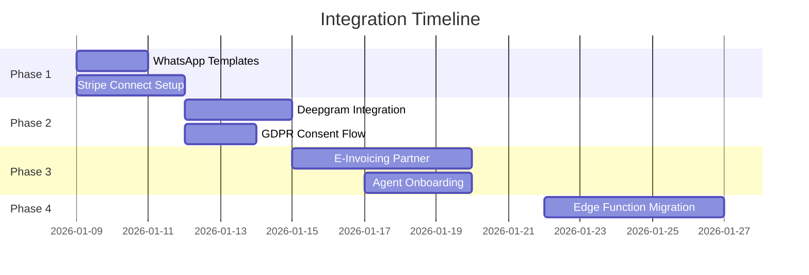

# Integration Plan - Post-Research Implementation

**Based on:** [Deep Research Report](file:///Users/lycanbeats/.gemini/antigravity/brain/43b869d9-418d-4444-bbee-cdabbb240a82/deep_research_report.md)
**Date:** 2026-01-08

---

## Overview

This plan outlines the implementation of research findings across 4 integration phases, prioritized by business impact and technical dependencies.



---

## Phase 1: Quick Wins (Jan 9-11)

### 1.1 WhatsApp Template Submission

**Goal:** Get core message templates approved for Tier 1 messaging.

| Template | Category | Content |
|----------|----------|---------|
| `lead_welcome` | Utility | "Ciao {{1}}! Sono l'assistente di {{2}}. Come posso aiutarti?" |
| `property_match` | Utility | "Abbiamo trovato {{1}} immobili per te. Vuoi vedere i dettagli?" |
| `appointment_reminder` | Utility | "Promemoria: Appuntamento {{1}} il {{2}} alle {{3}}" |
| `payment_reminder` | Utility | "Promemoria: Pagamento di €{{1}} in scadenza il {{2}}" |

**Files to Create:**
- `docs/whatsapp/templates.json` - Template definitions for Meta submission

---

### 1.2 Stripe Connect Platform Registration

**Goal:** Enable multi-agent payment splits with application fees.

**Steps:**
1. Register as Stripe Connect platform (Express accounts)
2. Configure application fee (15% default)
3. Create agent onboarding flow

#### [NEW] infrastructure/adapters/stripe_connect_adapter.py

```python
class StripeConnectAdapter:
    def create_connected_account(self, agent_email: str) -> str:
        """Create Express account for agent."""

    def create_payment_with_fee(self, amount: int, agent_id: str) -> PaymentIntent:
        """Create payment with platform fee split."""

    def get_agent_dashboard_link(self, account_id: str) -> str:
        """Generate Express dashboard login link."""
```

#### [MODIFY] domain/ports.py
Add `PaymentPort` interface for Stripe operations.

#### [MODIFY] config/container.py
Register `StripeConnectAdapter` in DI container.

---

## Phase 2: Voice & Compliance (Jan 12-14)

### 2.1 Deepgram Italian STT Integration

**Goal:** Real-time Italian transcription with sub-300ms latency.

#### [NEW] infrastructure/adapters/deepgram_adapter.py

```python
class DeepgramAdapter:
    MODEL = "nova-3"
    LANGUAGE = "it"

    async def stream_transcription(self, audio_stream) -> AsyncGenerator[str, None]:
        """Stream audio to Deepgram and yield transcripts."""

    async def transcribe_file(self, audio_url: str) -> str:
        """Batch transcription for recordings."""
```

#### [MODIFY] presentation/api/webhooks/voice_webhook.py
- Replace existing STT with `DeepgramAdapter`
- Add streaming WebSocket handler for Twilio Media Streams

**Environment Variables:**
```
DEEPGRAM_API_KEY=your_key_here
```

---

### 2.2 GDPR Call Recording Consent

**Goal:** Legal compliance for Italian call recordings.

#### [NEW] domain/models.py (additions)

```python
class CallConsent(BaseModel):
    call_id: str
    phone: str
    consent_given: bool
    consent_timestamp: datetime
    consent_method: Literal["ivr", "verbal", "written"]
```

#### [NEW] docs/sql/20260112_call_consent.sql

```sql
CREATE TABLE call_consents (
    id UUID PRIMARY KEY DEFAULT gen_random_uuid(),
    call_id TEXT NOT NULL,
    phone TEXT NOT NULL,
    consent_given BOOLEAN DEFAULT FALSE,
    consent_timestamp TIMESTAMPTZ,
    consent_method TEXT,
    created_at TIMESTAMPTZ DEFAULT NOW()
);
```

#### [MODIFY] infrastructure/adapters/twilio_adapter.py
- Add IVR consent prompt before recording
- Log consent to `call_consents` table

---

## Phase 3: Payments & Invoicing (Jan 15-20)

### 3.1 Italian E-Invoicing Integration

**Goal:** SDI-compliant electronic invoicing via FatturaPA.

**Recommended Provider:** Fattura24, Aruba, or InvoiceNinja with SDI plugin

#### [NEW] infrastructure/adapters/einvoice_adapter.py

```python
class EInvoiceAdapter:
    def create_invoice(self, invoice_data: InvoiceData) -> str:
        """Create and submit invoice to SDI."""

    def get_invoice_status(self, invoice_id: str) -> InvoiceStatus:
        """Check SDI acceptance status."""
```

#### [NEW] domain/models.py (additions)

```python
class InvoiceData(BaseModel):
    partita_iva: str
    codice_destinatario: str
    amount: Decimal
    description: str
    vat_rate: Decimal = Decimal("0.22")
```

---

### 3.2 Agent Onboarding Flow

**Goal:** Self-service agent registration with Stripe + VAT collection.

#### [NEW] presentation/api/routes/agent_onboarding.py

```python
@router.post("/agents/onboard")
async def onboard_agent(request: AgentOnboardRequest):
    # 1. Create Stripe Express account
    # 2. Collect Partita IVA and Codice Destinatario
    # 3. Store in users table
    # 4. Return Express dashboard link
```

---

## Phase 4: Architecture Optimization (Jan 22-27)

### 4.1 Edge Function Migration (Selective)

**Goal:** Move lightweight webhook handlers to Supabase Edge for lower latency.

**Migrate to Edge:**
- Webhook signature validation
- Rate limiting layer
- Simple health checks

**Keep in FastAPI:**
- All LangGraph workflows
- Embedding generation
- Business logic

#### [NEW] supabase/functions/webhook-validator/index.ts

```typescript
Deno.serve(async (req) => {
  const signature = req.headers.get("X-Hub-Signature-256");
  // Validate and forward to FastAPI
});
```

---

## Verification Plan

### Automated Tests

| Component | Test File | Command |
|-----------|-----------|---------|
| Stripe Connect | `tests/unit/test_stripe_connect.py` | `pytest tests/unit/test_stripe_connect.py` |
| Deepgram | `tests/unit/test_deepgram_adapter.py` | `pytest tests/unit/test_deepgram_adapter.py` |
| E-Invoice | `tests/unit/test_einvoice_adapter.py` | `pytest tests/unit/test_einvoice_adapter.py` |

### Manual Verification

- [ ] Send test WhatsApp template message
- [ ] Process test payment with fee split
- [ ] Verify call consent IVR prompt
- [ ] Submit test invoice to SDI sandbox

---

## Environment Variables Required

```env
# Phase 1
STRIPE_SECRET_KEY=sk_live_xxx
STRIPE_CONNECT_CLIENT_ID=ca_xxx

# Phase 2
DEEPGRAM_API_KEY=xxx

# Phase 3
EINVOICE_API_KEY=xxx
EINVOICE_CODICE_FISCALE=xxx
```

---

## Success Criteria

| Metric | Target | Verification |
|--------|--------|--------------|
| WhatsApp templates approved | 4/4 | Meta Business Manager |
| Agent onboarding time | < 5 min | Manual test |
| Voice transcription latency | < 300ms | Deepgram dashboard |
| Payment fee split | 15% to platform | Stripe dashboard |
| Invoice SDI acceptance | 100% | E-invoice provider |
