# 🏆 Sales Journey Blueprint: From Lead to Closed Deal

This document provides a detailed, step-by-step guide on how the AI Agency platform handles the complete customer lifecycle, ensuring maximum conversion at every touchpoint.

---

## 🗺️ The complete Lifecycle

```mermaid
graph TD
    subgraph Phase 1: Acquisition
    A[Visitor on Web / Portals] --> B{Entry Point}
    B -->|AI Appraisal| C[Free Valuation Form]
    B -->|Portal Inquiry| D[Email/Webhook Portals]
    end

    subgraph Phase 2: Engagement
    C --> E[🤖 AI Sends Valuation Report]
    D --> F[🤖 AI Contextual Greeting]
    E --> G[💬 WhatsApp Conversation]
    F --> G
    end

    subgraph Phase 3: Qualification
    G --> H[📊 RAG Matching]
    H --> I[👤 Profile Built: Budget/Zone]
    I --> J{Lead Hot?}
    J -->|Yes| K[📅 Appointment Steering]
    J -->|No| L[🔄 Long-term Drip]
    end

    subgraph Phase 4: Closing
    K --> M[🤝 Viewing / Human Meeting]
    M --> N[📊 Market Data Negotiation]
    N --> O[💰 SALE COMPLETED]
    end
```

---

## 📍 Phase 1: The Reach-Out (Acquisition)

### 1.1 The "Free AI Appraisal" Magnet
*   **Action**: A visitor lands on your site and sees the **"Valuta la tua casa con AI"** button.
*   **Psychology**: Zero friction. They just want a number.
*   **System**: They enter their address and phone number. The system immediately captures this as a **HOT lead** with a specific `RICHIESTA VALUTAZIONE` tag.

### 1.2 The Portal Lead (Immobiliare/Idealista)
*   **Action**: A user clicks "Invia Messaggio" on a portal listing for a "Trilocale a Milano".
*   **System**: The portal sends a webhook/email. The AI parses the user name, phone, and the **specific house** they are looking at.

---

## 📍 Phase 2: The Instant Response (Engagement)

### 2.1 The "Magic" Moment
*   **AI Action**: Within 15 seconds, the user receives a WhatsApp.
    *   *Portals*: "Ciao [Nome], ho visto che ti interessa l'appartamento in [Via]. È ancora disponibile! Hai già visto le planimetrie?"
    *   *Appraisal*: "Ecco la valutazione AI per il tuo immobile: Valore stimato tra €450k e €490k. Vorresti una stima precisa di persona?"
*   **Goal**: Kill the competition. By being the first to respond, you win the attention battle.

---

## 📍 Phase 3: Qualification & Data profiling (Qualification)

### 3.1 Smart RAG Matching
*   **Process**: As the user replies ("Cerco qualcosa di più grande" or "Il mio budget è 500k"), the AI:
    1.  **Analyzes**: Extracts `min_sqm`, `rooms`, and `budget_max`.
    2.  **RAG Search**: Queries the Supabase `properties` table for direct matches.
    3.  **Alternative Matching**: If the specific house is gone, it says: *"Quello è venduto, ma ho appena caricato un bilocale simile in zona Brera a €480k. Ti mando le foto?"*

### 3.2 Building the Lead Profile (Data 2.0)
*   **Database**: The system automatically saves their budget and preferred zones. This allows you to filter your hottest leads in the Dashboard by budget, even if you never talked to them.

---

## 📍 Phase 4: The Hand-Off (Conversion)

### 4.1 Appointment Steering
*   **Trigger**: Once the AI identifies interest, it presents the **Calendly Link**.
*   **Action**: *"Se vuoi vederla dal vivo, puoi bloccare un appuntamento per domani qui: [Link]"*.
*   **Human Takeover**: If the user says *"Voglio parlare con il titolare"*, the owner receives a **Telegram/WhatsApp alert** and the AI mutes itself. You step in when the deal is "warm".

---

## 📍 Phase 5: Closing supported by Data (Closing)

### 5.1 Negotiation Power
*   **Tool**: Use the `market_scraper.py` data to show the buyer (or seller) that your price is fair compared to the area average.
*   **The Close**: Because the AI has handled 90% of the repetitive Q&A and scheduling, your human energy is 100% focused on the final signature.

---

## 🚀 Key Advantages of this Flow
1.  **24/7 Availability**: You never lose a lead because it's 2 AM.
2.  **Zero Manual Formatting**: Leads are saved, sorted, and scored automatically.
3.  **Data-Driven**: Every response is based on real market numbers and your active portfolio.
